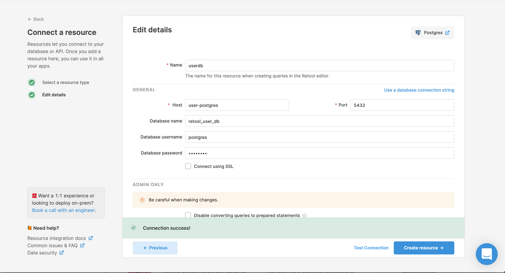
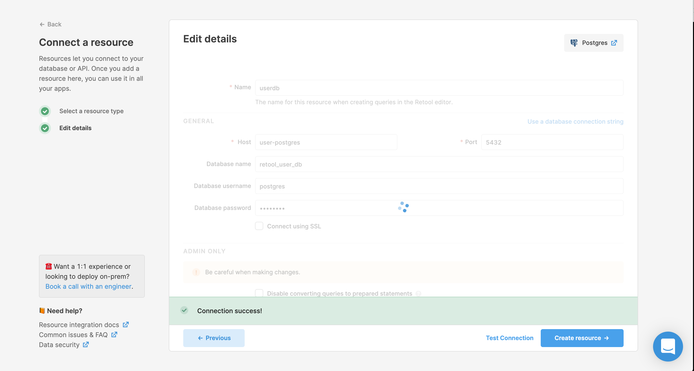

# BUG Report

## Version

    tryretool/backend:2.63.5  # broken
    tryretool/backend:2.63.15 # fixed

## Test Procedure

- (once only) After receiving the branch, check it out and run retag.sh to add 3 tags
```
./retag.sh
```

- Reset the environment
```
docker-compose down -v
```

- Checkout the failing testcase
```
git checkout testcase-B
```

- To see what changed:
```
git diff HEAD~1 HEAD #  to see what changed
```
- Create the enviroment (with rebuild)
```
docker-compose up -d --build
```
- Create a new user
- Configure a new postgres resource pointing at retool_user_db



- Test the new postgres resource successfully.
- Save the new postgres resource successfully.

The same procedure can also be executed for the successful variants - testcase-A and testcase-C, but these cases produce the expected behaviour.

## Expected Behaviour

- Resource is created and saved correctly.

## Actual Behaviour

- "Save the new postgres resource successfully" step fails with this user symptom:

    

- and following messages in the [logs](logs.txt)
```
    api_1            | /snapshot/retool/node_modules/pg-pool/index.js:353
    api_1            |           return cb(undefined, res)
    api_1            |                  ^
    api_1            |
    api_1            | TypeError: Cannot destructure property `customReadOperations` of 'undefined' or 'null'.
    api_1            |     at extractPrivileges (/snapshot/retool/common/utils.js:0:0)
    api_1            |     at pool.query (/snapshot/retool/dbconnector/connectors/postgres.js:0:0)
    api_1            |     at Query.query.connect.client.query (/snapshot/retool/node_modules/pg-pool/index.js:353:18)
    api_1            |     at Query.handleReadyForQuery (/snapshot/retool/node_modules/pg/lib/query.js:128:10)
    api_1            |     at Connection.<anonymous> (/snapshot/retool/node_modules/pg/lib/client.js:247:19)
    api_1            |     at Connection.emit (events.js:198:13)
    api_1            |     at Connection.EventEmitter.emit (domain.js:448:20)
    api_1            |     at Socket.<anonymous> (/snapshot/retool/node_modules/pg/lib/connection.js:134:12)
    api_1            |     at Socket.emit (events.js:198:13)
    api_1            |     at Socket.EventEmitter.emit (domain.js:448:20)
    api_1            |     at addChunk (_stream_readable.js:288:12)
    api_1            |     at readableAddChunk (_stream_readable.js:269:11)
    api_1            |     at Socket.Readable.push (_stream_readable.js:224:10)
    api_1            |     at TCP.onStreamRead [as onread] (internal/stream_base_commons.js:94:17)
    api_1            | [Master] Worker 88 died. 0 workers left
    api_1            | [Master] replacing worker
```

# Notes

The same problem does not occur when the db-connector is running as a separate docker-compose service (testcase-A) or when tryretool/backend is upgraded from 2.63.5 to 2.63.15 (testcase-C)

Another niggle is that during testing I noticed that sometimes the redirect that happens after the resource URL is created encounters a 404 condition, indicating the presence of a race condition of some kind. However, this condition is rectified with a browser refresh.

# Logs

The container logs are included as the file logs.txt in the github bug branch.
